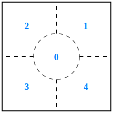

# ImageProcess

## Projecting

这个类的作用是：在知道相机内参（Intrinsics）和外参（Extrinsics）情况下，输出图像中某些特定目标在真实世界的二维坐标。

### 初始化

`Projecting` 初始化需要提供 `yaml` 配置文件的路径，其中 `yaml` 文件需要提供的参数有：

- Image.width：图片宽度；
- Image.height：图片高度；
- CameraMatrix：相机的内参矩阵；
- DistortionCoefficients：相机的畸变系数；
- BaseSizeAndDepth：相机所在的移动平台的 x、y 轴移动范围，以及相机距离拍摄对象的高度；
- Threashold：目标在图像中像素大小的 3 个临界值；
- ErrorCompensation：为了提高精度而提出的 x、y 方向上的误差补偿；
- DisplayMode：显示模式（`show_index` or `show_area` or `show_nothing`），在可视化输出时，可以选择在目标检测框上方显示目标的序号，或者目标在图像中所占据的像素面积。


### 公用接口

#### locateTarget

**函数重载 1**：

```c++
std::vector<cv::Point2f> locateTarget(const cv::Mat& src) const;
```

> 检测输入图像中的目标的坐标位置，并输出一组现实二维坐标点。

**函数重载 2**：

```c++
void locateTarget(const cv::Mat& src, cv::Mat& dst) const;
```

> 检测输入图像中的目标，并进行框选，将可视化结果储存在 `dst` 中。

#### locateHeap

**函数重载 1**：

```c++
std::unordered_set<uint8_t> locateHeap(const cv::Mat& src) const;
```

> 检测输入图像中==发生堆积==的目标坐标位置，并输出一组存有放置目标物的托盘（振动盘）的产生堆积的区域代号，该组代号以 `std::unordered_set` 为容器。

托盘区域代号划分示意图如下：



**函数重载 2**：

```c++
void locateHeap(const cv::Mat& src, cv::Mat& dst) const;
```

> 检测输入图像中==发生堆积==的目标坐标位置，并进行框选，将可视化结果储存在 `dst` 中。


## FocusStacking

这个类的作用是：在相机与被摄物保持相对不动的条件下，通过合成多张对焦在被摄物的不同位置平面的照片，达到景深融合的效果。

### 公用接口

